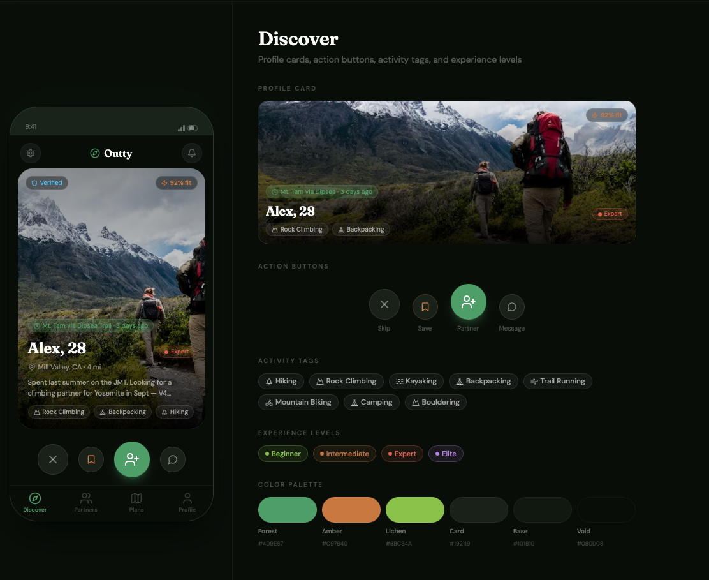
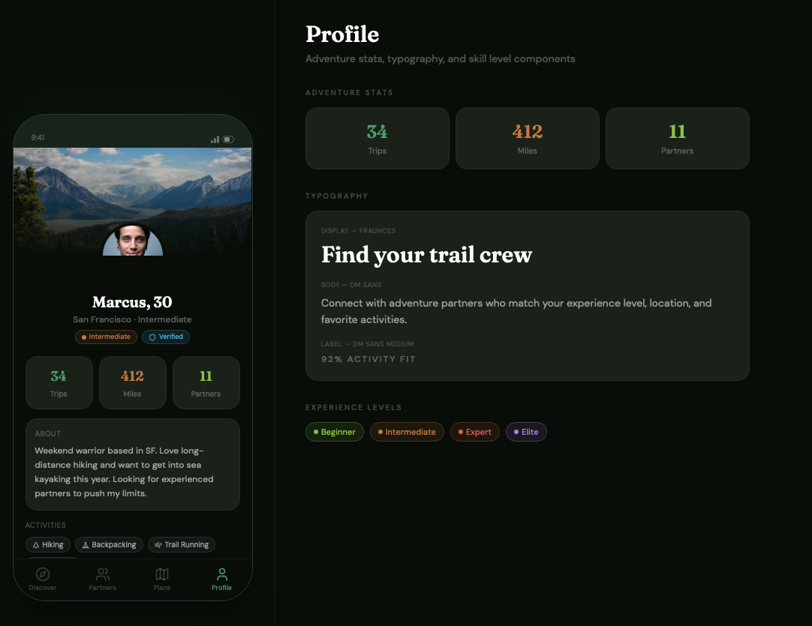
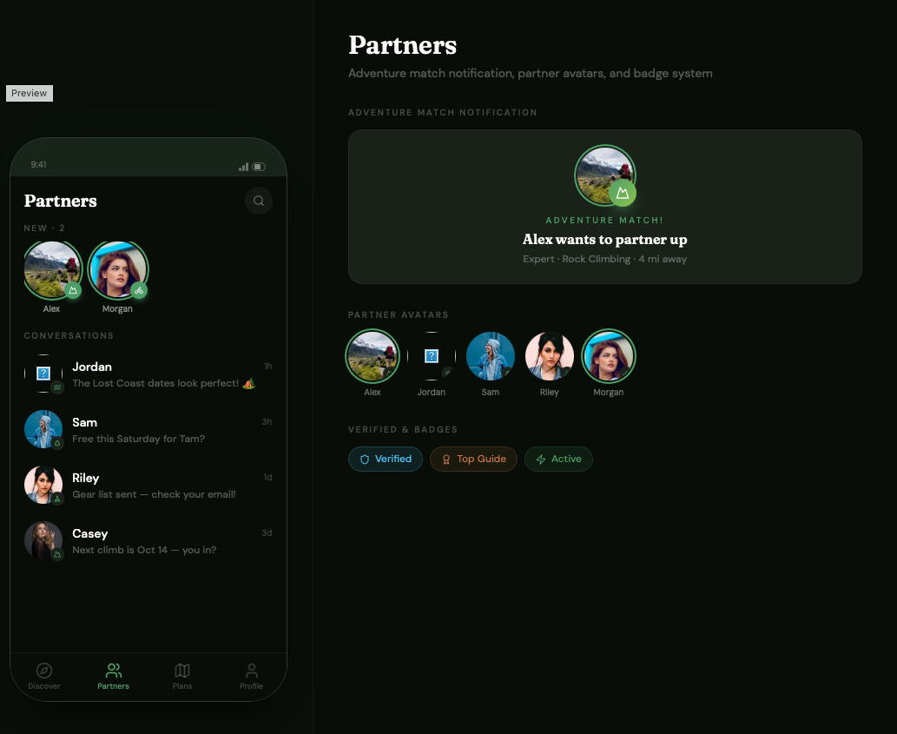
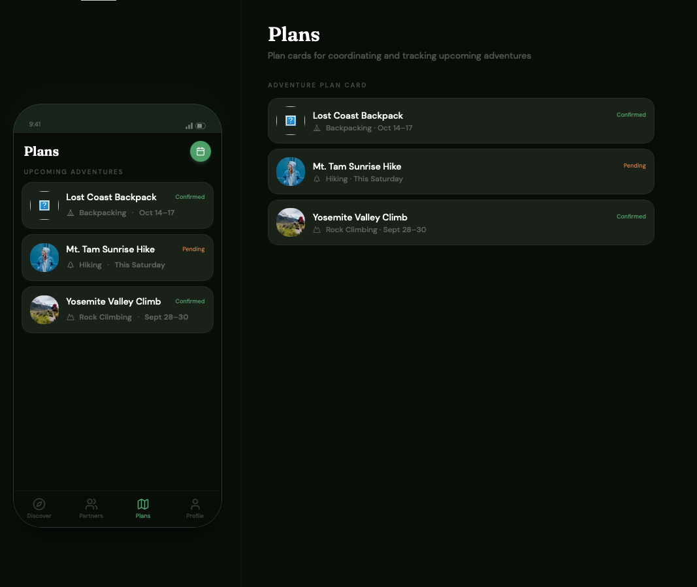
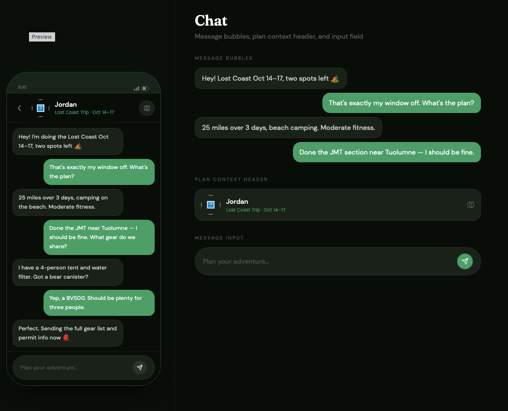

# Outty — Figma Designs

Exported screens from the Outty Figma file. Source PNGs live in [docs/assets/FigmaDesign](assets/FigmaDesign/).

---

## Discover

Swipe deck — profile cards, action buttons (skip / save / partner / message), activity tags, experience levels.
Referenced by Sprint 2 US-10 (Swipe Left/Right UI) and US-11 (Matching Algorithm).

---

## Profile

Adventure stats, bio, and activity tags for a user's profile.
Referenced by Sprint 1 US-02 (Create Profile).

---

## Partners

Match notifications, partner avatars, conversation list, verified/badge system.
Referenced by Sprint 2 US-12 (Match Notification).

---

## Plans

Adventure plan cards for coordinating and tracking upcoming trips.

---

## Chat

Message bubbles, plan context header, and message input for coordinating a trip with a partner.

