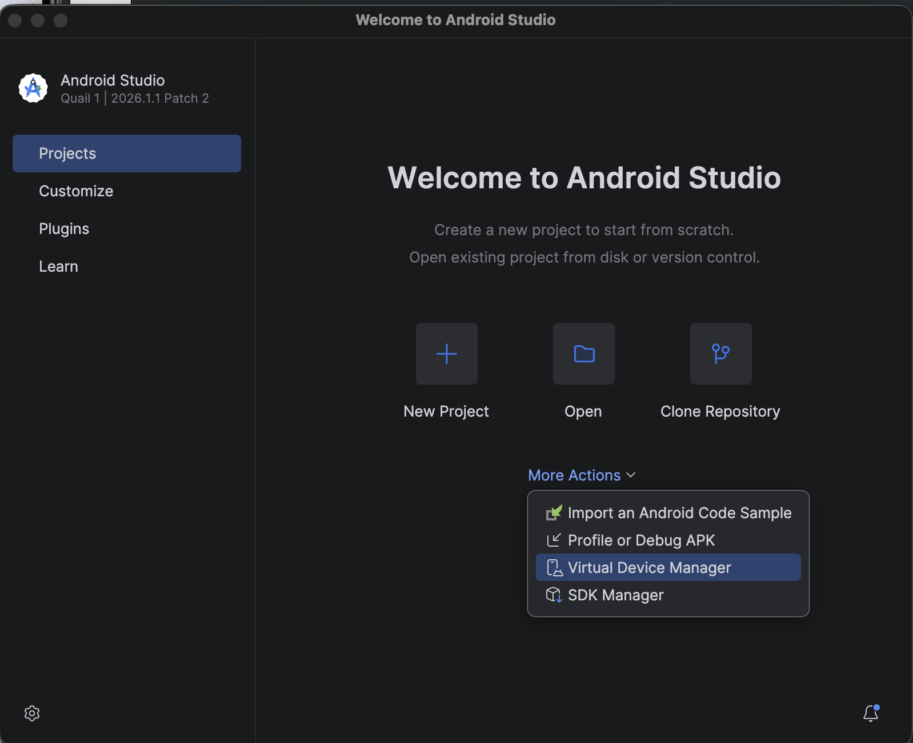

# Developer Setup Guide

This guide explains how to set up the development environment for the Outty application. Follow these steps before building or running the project.

---

# System Requirements

Before you begin, install the following software:

- .NET 10 SDK
- .NET MAUI Workload
- Java 17
- Android Studio (for Android development)
- Git

---

# Clone the Repository

Clone the repository and navigate to the project folder.

```bash
git clone https://github.com/dmitc072/OuttyDatingApp.git
cd OuttyDatingApp
```

---

# Install .NET MAUI

Install the .NET MAUI workload (run once per machine).

```bash
sudo dotnet workload install maui
```

Verify the installation:

```bash
dotnet workload list
```

---

# Install Java 17

Android development requires Java 17.

macOS:

```bash
brew install --cask temurin@17
```

Verify the installation:

```bash
java -version
```

---

# Restore Project Dependencies

```bash
dotnet restore
```

---

# Install Android SDK Components

Run the following command to install the required Android SDK packages.

```bash
dotnet build src/Outty.Mobile \
-t:InstallAndroidDependencies \
-f net10.0-android \
-p:AndroidSdkDirectory=$HOME/Library/Developer/Xamarin/android-sdk-macosx \
-p:AcceptAndroidSDKLicenses=true
```

---

# Build the Project

```bash
dotnet build
```

---

# Running the Application

## Run the Web API

```bash
dotnet run --project src/Outty.Api
```

---

## Run the Mobile Application

### Android Device

1. Enable **Developer Options**.
2. Enable **USB Debugging**.
3. Connect the device using a USB cable.
4. Run:

```bash
dotnet run --project src/Outty.Mobile -f net10.0-android
```

---

## Android Emulator

1. Install **Android Studio** from https://developer.android.com/studio.
2. Open Android Studio.
3. On the **Welcome** screen, select **More Actions → Virtual Device Manager**.



4. Click **Create Device**.
5. Choose a device (recommended: **Pixel 10**).
6. Select a **Google Play** system image.
7. Finish the setup and start the emulator.

Run the mobile application:

```bash
dotnet run --project src/Outty.Mobile -f net10.0-android
```

> **Recommendation:** Use a Google Play system image. During development, the **Pixel 10** emulator provided the best compatibility for image selection and other Android features.

---

### Windows

Run the Windows version of the application on a Windows machine.

```bash
dotnet run --project src/Outty.Mobile -f net10.0-windows10.0.19041.0
```

---

# Troubleshooting

| Problem                           | Solution                                                                    |
| --------------------------------- | --------------------------------------------------------------------------- |
| Android SDK not found             | Install the Android SDK dependencies and rebuild the project.               |
| Android SDK licenses not accepted | Add `-p:AcceptAndroidSDKLicenses=true` to the build command.                |
| `project.assets.json` missing     | Run `dotnet restore`.                                                       |
| Java version error                | Install Java 17 and verify it is the active version.                        |
| Photo picker not working          | Use an emulator with a **Google Play** system image (Pixel 10 recommended). |
| MAUI workload missing             | Run `sudo dotnet workload install maui`.                                    |

---

# Helpful Resources

- [.NET MAUI Documentation](https://learn.microsoft.com/dotnet/maui/)
- [ASP.NET Core Documentation](https://learn.microsoft.com/aspnet/core/)
- [Android Studio](https://developer.android.com/studio)
- [GitHub Actions Documentation](https://docs.github.com/actions)

---

If you experience additional setup issues, consult the official documentation above or contact a member of Team Outty.
